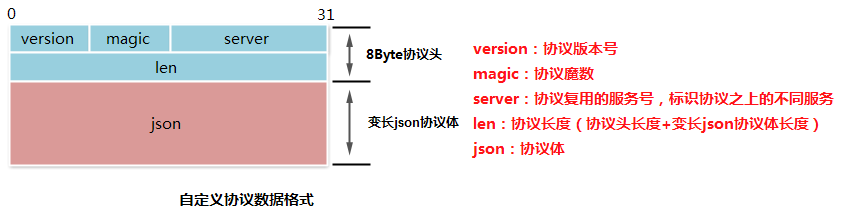
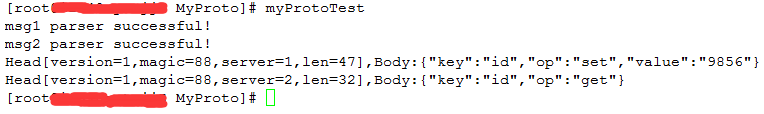

## 协议设计

### 协议头 

8字节的定长协议头。支持版本号，基于魔数的快速校验，不同服务的复用。定长协议头使协议易于解析且高效。

### 协议体 

变长json作为协议体。json使用明文文本编码，可读性强、易于扩展、前后兼容、通用的编解码算法。json协议体为协议提供了良好的扩展性和兼容性。
协议可视化图 





## 协议实现

```c

/*
    协议头
 */
struct MyProtoHead
{
    uint8_t version;    //协议版本号
    uint8_t magic;      //协议魔数
    uint16_t server;    //协议复用的服务号，标识协议之上的不同服务
    uint32_t len;       //协议长度（协议头长度+变长json协议体长度）
};

```

### 协议消息体

```c

/*
    协议消息体
 */
struct MyProtoMsg
{
    MyProtoHead head;   //协议头
    Json::Value body;   //协议体
};

```

### 打包类

```c

/*
    MyProto打包类
 */
class MyProtoEnCode
{
public:
    //协议消息体打包函数
    uint8_t * encode(MyProtoMsg * pMsg, uint32_t & len);
private:
    //协议头打包函数
    void headEncode(uint8_t * pData, MyProtoMsg * pMsg);
};

```

### 解包类

```c

typedef enum MyProtoParserStatus
{
    ON_PARSER_INIT = 0,
    ON_PARSER_HAED = 1,
    ON_PARSER_BODY = 2,
}MyProtoParserStatus;
/*
    MyProto解包类
 */
class MyProtoDeCode
{
public:
    void init();
    void clear();
    bool parser(void * data, size_t len);
    bool empty();
    MyProtoMsg * front();
    void pop();
private:
    bool parserHead(uint8_t ** curData, uint32_t & curLen, 
        uint32_t & parserLen, bool & parserBreak);
    bool parserBody(uint8_t ** curData, uint32_t & curLen, 
        uint32_t & parserLen, bool & parserBreak);
private:
    MyProtoMsg mCurMsg;                     //当前解析中的协议消息体
    queue<MyProtoMsg *> mMsgQ;              //解析好的协议消息队列
    vector<uint8_t> mCurReserved;           //未解析的网络字节流
    MyProtoParserStatus mCurParserStatus;   //当前解析状态
};

```


## 运行测试




